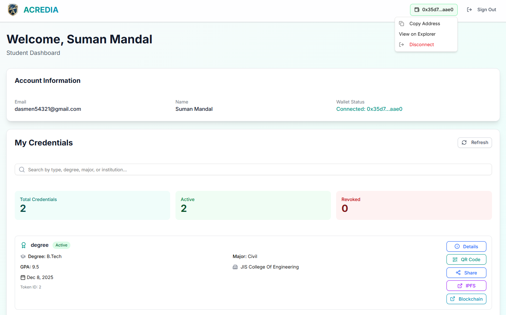
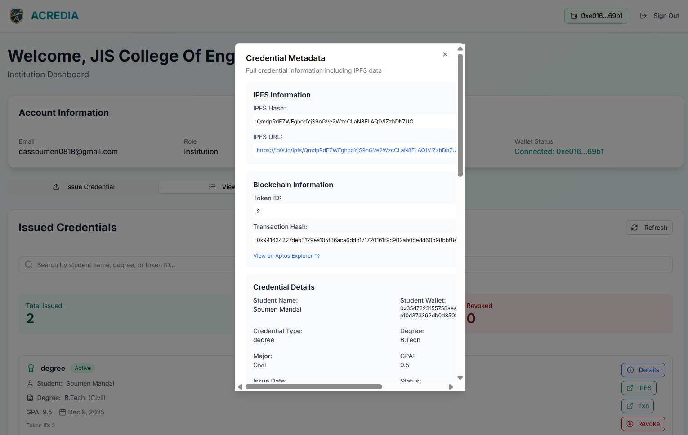
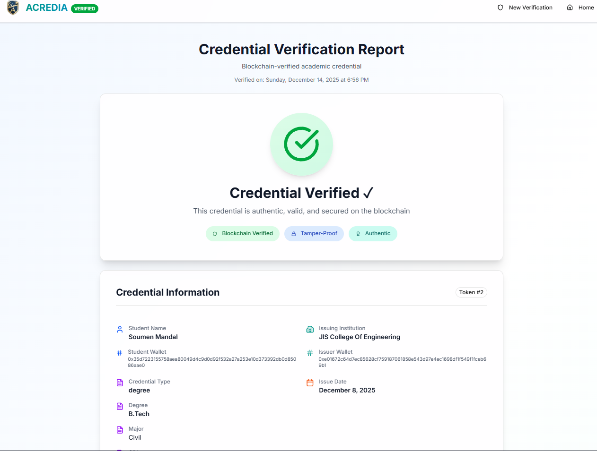
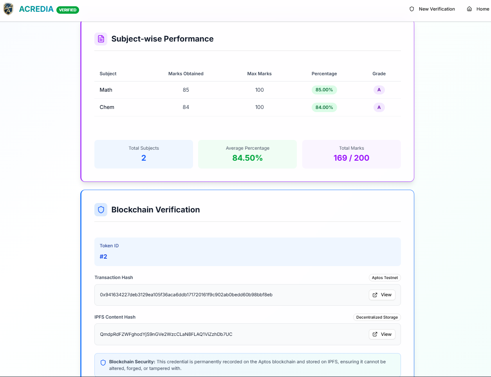
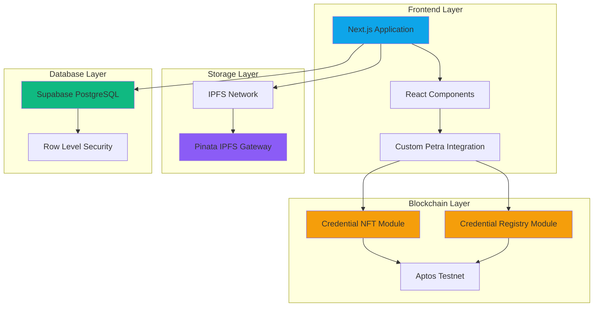
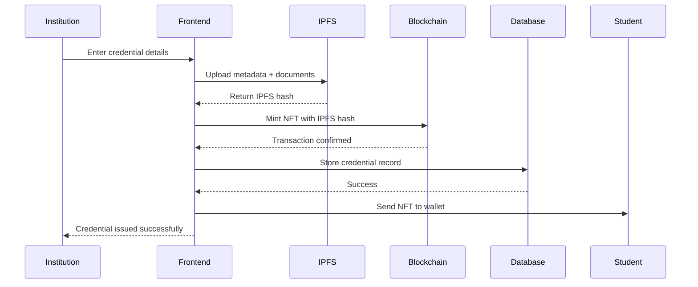
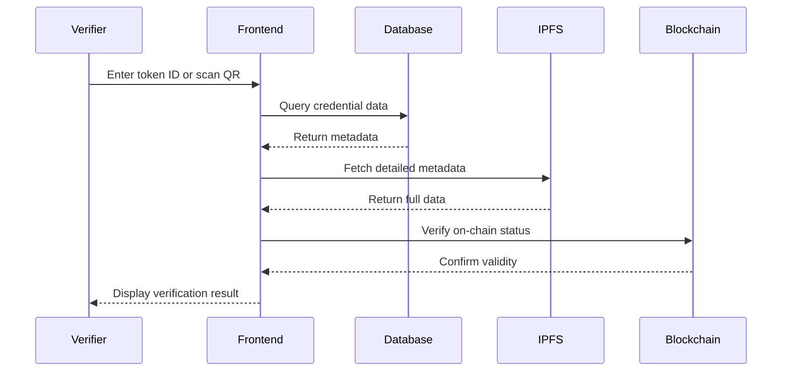

# ACREDIA

<div align="center">
  
  
  ### Blockchain-Based Academic Credential Verification System
  
  *Secure, Transparent, and Tamper-Proof Educational Credentials on the Blockchain*

  
  
  
  
  
  
</div>


## 📑 Table of Contents

- [Overview](#-overview)
- [The Problem](#-the-problem)
- [Our Solution](#-our-solution)
- [Screenshots](#-screenshots)
- [Key Features](#-key-features)
- [Smart Contracts](#-smart-contracts)
- [Technology Stack](#-technology-stack)
- [System Architecture](#-system-architecture)
- [How It Works](#-how-it-works)
- [Getting Started](#-getting-started)
- [Environment Setup](#-environment-setup)
- [Usage Guide](#-usage-guide)
- [Project Structure](#-project-structure)
- [Team](#-team)

---

## 🌟 Overview

**Acredia** is a revolutionary decentralized platform that transforms how academic credentials are issued, stored, and verified. By leveraging Aptos blockchain with Move smart contracts, IPFS, and modern web technologies, Acredia eliminates credential fraud, reduces verification time, and provides lifetime access to verified academic records.

### Why Acredia?

Traditional paper-based or centralized digital credentials suffer from:
- Easy forgery and tampering
- Time-consuming verification processes
- Risk of loss or damage
- Limited accessibility
- Centralized control and single points of failure

Acredia solves these problems by creating **immutable, blockchain-verified credentials** that are:
- ✅ Permanent and tamper-proof
- ✅ Instantly verifiable
- ✅ Decentralized and censorship-resistant
- ✅ Accessible anywhere, anytime
- ✅ Privacy-preserving with student control

---

## 🎯 The Problem

The current academic credential system faces critical challenges:

1. **Credential Fraud**: Fake degrees and certificates cost employers billions annually
2. **Slow Verification**: Manual verification takes days or weeks
3. **Institutional Dependency**: Students rely on institutions to provide transcripts
4. **Data Loss**: Physical documents can be lost, damaged, or destroyed
5. **Privacy Concerns**: Sharing full credentials when only partial verification is needed

---

## 💡 Our Solution

Acredia creates a **three-layer verification system**:

1. **Blockchain Layer**: Immutable credential records on Aptos Testnet using Move smart contracts
2. **Storage Layer**: Decentralized metadata storage on IPFS via Pinata
3. **Database Layer**: Fast querying and indexing via Supabase PostgreSQL

This architecture ensures credentials are:
- **Permanent**: Stored on blockchain forever
- **Verifiable**: Instant verification via token ID or QR code
- **Decentralized**: No single point of failure
- **Detailed**: Subject-wise marks, grades, and complete academic records
- **Accessible**: Students own their credentials via NFTs

---

## 📸 Screenshots

### Landing Page


*Modern, responsive landing page showcasing the platform's features*

### Student Dashboard


*Students can view all their credentials with detailed information and blockchain verification*

### Institution Dashboard


*Institutions can issue credentials with subject-wise marks, grades, and complete academic records*

### Credential Verification


*Public verification page with blockchain proof and comprehensive credential details*



*Detailed subject-wise performance and blockchain transaction information*

### Admin Panel


*Contract owner dashboard for authorizing institutions and monitoring system statistics*

---

## ⚡ Key Features

### For Students
- **Digital Wallet**: Receive credentials as NFTs in your wallet
- **Instant Access**: View all credentials anytime, anywhere
- **Easy Sharing**: Generate QR codes or shareable verification links
- **Subject Details**: Access complete subject-wise marks and grades
- **Lifetime Ownership**: Credentials stored permanently on blockchain

### For Institutions
- **Simple Issuance**: Issue credentials with an intuitive web interface
- **Subject-Wise Records**: Add detailed marks, grades, and performance data
- **Batch Processing**: Upload credentials for multiple students
- **Blockchain Verification**: Each credential is verifiable on-chain
- **Authorization Control**: Admin-approved issuer system

### For Verifiers (Employers/Universities)
- **Instant Verification**: Verify credentials in seconds via token ID or QR code
- **Blockchain Proof**: Direct links to blockchain transactions
- **Complete Details**: View student information, institution, marks, and grades
- **No Login Required**: Public verification page accessible to anyone
- **Tamper-Proof**: Impossible to forge or modify credentials

### For Administrators
- **Authorization Management**: Approve institutions to issue credentials
- **System Statistics**: Real-time dashboard with credential counts
- **Contract Ownership**: Full control over smart contract parameters
- **Security**: Only contract owner can authorize new issuers

---

## 📜 Smart Contracts

Acredia uses Move smart contracts deployed on **Aptos Testnet**:

### Credential NFT Module
**Module Address**: `0x262e014c482dbed31f46796ed1acd3ebe69a8d4572c5177a7774ef9add39d029`

**Deployment Transaction**: [0xcbf1b7b6c85d5b2ce5717ce3fbad2c56c8d0f41d0277665941e06b0307e0e71a](https://explorer.aptoslabs.com/txn/0xcbf1b7b6c85d5b2ce5717ce3fbad2c56c8d0f41d0277665941e06b0307e0e71a?network=testnet)

**View on Explorer**: [https://explorer.aptoslabs.com/account/0x262e014c482dbed31f46796ed1acd3ebe69a8d4572c5177a7774ef9add39d029?network=testnet](https://explorer.aptoslabs.com/account/0x262e014c482dbed31f46796ed1acd3ebe69a8d4572c5177a7774ef9add39d029?network=testnet)

**Key Functions**:
- `initialize()` - Initialize the credential store (one-time setup, deployer only)
- `authorize_issuer(issuer: address)` - Authorize institution to issue credentials
- `issue_credential(student: address, hash: vector<u8>, uri: String)` - Issue credential NFT to student
- `revoke_credential(token_id: u64)` - Revoke a credential if needed
- `get_owner()` - Retrieve the contract owner address
- `get_authorized_issuers()` - View list of authorized issuer addresses

> **Note**: This module is deployed on Aptos testnet. You can verify all transactions and view the module code on Aptos Explorer using the links above.


---

## 🛠 Technology Stack

### Frontend
### Frontend
- **Next.js 15.5.7** - React framework with App Router for optimal performance
- **TypeScript** - Type-safe development
- **Tailwind CSS** - Utility-first styling
- **Radix UI** - Accessible component primitives
- **Custom Petra Integration** - Direct wallet connection via window.aptos API
- **Lucide React** - Modern icon library

### Blockchain
- **Move** - Smart contract language for Aptos
- **Aptos CLI** - Development environment and deployment tool
- **Aptos Testnet** - Test network deployment
- **@aptos-labs/ts-sdk** - TypeScript SDK for Aptos interactions
- **Petra Wallet** - Browser wallet for Aptos blockchain

### Storage & Backend
- **Pinata** - Production IPFS gateway for decentralized metadata storage
- **IPFS** - Decentralized file storage protocol
- **Supabase** - PostgreSQL database with Row Level Security
- **PostgreSQL** - Relational database for indexing
- **RESTful APIs** - Custom API routes in Next.js

### Development Tools
- **pnpm** - Fast, disk-efficient package manager
- **ESLint** - Code quality
- **Prettier** - Code formatting
- **Git** - Version control

---

## 🏗 System Architecture



### Architecture Layers

1. **Presentation Layer**: User interfaces for students, institutions, and verifiers
2. **Application Layer**: Business logic, authentication, and API routes
3. **Blockchain Layer**: Smart contracts for credential NFTs and registry
4. **Storage Layer**: Pinata IPFS gateway for decentralized metadata storage
5. **Database Layer**: Supabase for fast queries and off-chain indexing

---

## 🔄 How It Works

### Credential Issuance Flow



### Verification Flow



### Step-by-Step Process

#### For Institutions (Issuing Credentials)

1. **Connect Wallet**: Institution connects authorized wallet
2. **Enter Student Details**: Name, wallet address, credential type
3. **Add Academic Data**: Degree, major, GPA, issue date
4. **Add Subject Marks**: Subject name, marks obtained, maximum marks, grade
5. **Upload to IPFS**: System uploads metadata to decentralized storage
6. **Mint NFT**: Smart contract mints credential NFT to student's wallet
7. **Database Record**: System creates searchable database entry
8. **Confirmation**: Student receives NFT in their wallet

#### For Students (Viewing Credentials)

1. **Login**: Authenticate with email or wallet
2. **Dashboard**: View all issued credentials
3. **Details**: Click credential to see complete information
4. **Share**: Generate QR code or verification link
5. **Download**: Export credential details or share blockchain proof

#### For Verifiers (Checking Credentials)

1. **Access**: Navigate to public verification page (no login required)
2. **Input**: Enter credential token ID or scan QR code
3. **Verification**: System checks blockchain and IPFS
4. **Results**: View complete credential details with blockchain proof
5. **Confirmation**: Verify authenticity via blockchain explorer link

---

## 🚀 Getting Started

### Prerequisites

Before you begin, ensure you have the following installed:

- **Node.js** (v18 or higher) - [Download](https://nodejs.org/)
- **pnpm** (v8 or higher) - Install via: `npm install -g pnpm`
- **Git** - [Download](https://git-scm.com/)
- **Petra Wallet** - Aptos browser wallet - [Install](https://petra.app/)
- **Aptos CLI** (optional, for contract development) - [Install Guide](https://aptos.dev/tools/aptos-cli/)

### Installation

1. **Clone the Repository**

```powershell
git clone https://github.com/thisisouvik/Arcedia.git
cd Arcedia
```

2. **Install Frontend Dependencies**

```powershell
cd frontend
pnpm install
```

3. **Install Contract Dependencies**

```powershell
cd ../contracts
pnpm install
```

### Configuration

4. **Set Up Environment Variables**

Create a `.env.local` file in the `frontend` directory:

```env
# Aptos Configuration
NEXT_PUBLIC_MODULE_ADDRESS=0x262e014c482dbed31f46796ed1acd3ebe69a8d4572c5177a7774ef9add39d029
NEXT_PUBLIC_APTOS_NETWORK=testnet
NEXT_PUBLIC_APTOS_NODE_URL=https://api.testnet.aptoslabs.com/v1

# Deployment Transaction
NEXT_PUBLIC_DEPLOYMENT_TX=0xcbf1b7b6c85d5b2ce5717ce3fbad2c56c8d0f41d0277665941e06b0307e0e71a

# Supabase Configuration
NEXT_PUBLIC_SUPABASE_URL=https://your-project.supabase.co
NEXT_PUBLIC_SUPABASE_ANON_KEY=your_supabase_anon_key

# Pinata IPFS Configuration (Production)
PINATA_JWT=your_pinata_jwt_token
PINATA_API_KEY=your_pinata_api_key
```

> **Note**: The Module Address and Deployment TX above are for the deployed Aptos testnet contract. If you deploy your own, replace these values.

### Database Setup

5. **Set Up Supabase Database**

Run the following SQL scripts in your Supabase SQL Editor:

```sql
-- Run these in order:
1. frontend/sql/database_schema.sql
2. frontend/sql/FIX_DATABASE_RLS.sql
3. frontend/sql/enable_public_verification.sql
4. frontend/sql/enable_admin_stats.sql
```

### Smart Contract Deployment

> **Note**: The Aptos smart contracts are already deployed on testnet. If you want to deploy your own:

6. **Compile and Deploy Contracts**

```powershell
cd contracts
aptos move compile
aptos move publish --profile default
```

7. **Verify Deployment on Aptos Explorer**

Visit: `https://explorer.aptoslabs.com/account/YOUR_MODULE_ADDRESS?network=testnet`

Replace `YOUR_MODULE_ADDRESS` with your deployed module address in `.env.local`

### Running the Application

8. **Start the Development Server**

```powershell
cd frontend
pnpm dev
```

9. **Open in Browser**

Navigate to [http://localhost:3000](http://localhost:3000)

### Production Build

```powershell
cd frontend
pnpm build
pnpm start
```

---

## ⚙️ Environment Setup

### Getting API Keys

#### Aptos Configuration
The contract is already deployed on Aptos Testnet. Use these values:
- **Module Address**: `0x262e014c482dbed31f46796ed1acd3ebe69a8d4572c5177a7774ef9add39d029`
- **Network**: Aptos Testnet
- **Node URL**: `https://api.testnet.aptoslabs.com/v1`
- **Explorer**: [Aptos Explorer](https://explorer.aptoslabs.com/account/0x262e014c482dbed31f46796ed1acd3ebe69a8d4572c5177a7774ef9add39d029?network=testnet)

#### Supabase Setup
1. Create account at [Supabase](https://supabase.com)
2. Create a new project
3. Get your project URL and anon key from Settings > API
4. Run the provided SQL scripts in SQL Editor (see Database Setup section)

#### Pinata (For IPFS Storage)
1. Visit [Pinata](https://pinata.cloud/)
2. Create free account
3. Generate API key and JWT token from API Keys section
4. Add to `.env.local` for production IPFS uploads
5. Free tier includes 1GB storage

### Wallet Setup

1. **Install Petra Wallet**
   - Visit [petra.app](https://petra.app/)
   - Install browser extension
   - Create or import wallet

2. **Switch to Aptos Testnet**
   - Open Petra wallet
   - Click network selector
   - Select "Testnet"

3. **Get Test APT**
   - Visit [Aptos Testnet Faucet](https://aptoslabs.com/testnet-faucet)
   - Enter your wallet address
   - Receive free test APT tokens

4. **Connect to Acredia**
   - Open the application
   - Click "Connect Wallet"
   - Approve connection in Petra

---

## 📖 Usage Guide

### For Administrators

**Authorizing Institutions**

1. Connect the contract owner wallet
2. Navigate to Admin Dashboard
3. Enter institution wallet address
4. Click "Authorize Wallet"
5. Confirm blockchain transaction
6. Institution can now issue credentials

### For Institutions

**Issuing a Credential**

1. Login with authorized institution account
2. Go to Dashboard > Issue Credential tab
3. Fill in student details:
   - Student Name
   - Student Wallet Address
   - Credential Type (Degree, Certificate, etc.)
   - Degree/Major/GPA
   - Issue Date
4. Add subjects (click "+ Add Subject"):
   - Subject Name
   - Marks Obtained
   - Maximum Marks
   - Grade (optional)
5. Click "Issue Credential"
6. Confirm wallet transaction
7. Wait for confirmation
8. Student receives NFT in their wallet

**Viewing Issued Credentials**

1. Go to Dashboard > Issued Credentials tab
2. View all credentials issued by your institution
3. See blockchain transaction hashes
4. Access IPFS metadata links

### For Students

**Viewing Your Credentials**

1. Login with student account
2. Dashboard displays all your credentials
3. Click on any credential to see:
   - Institution details
   - Credential type and dates
   - Subject-wise marks and grades
   - Overall performance statistics
   - Blockchain verification proof

**Sharing Credentials**

1. Click "Share" on any credential
2. Options:
   - Generate QR Code
   - Copy verification link
   - Share token ID
3. Recipients can verify without login

### For Verifiers (Employers/Universities)

**Verifying Credentials**

1. Go to verification page (no login required)
2. Enter credential token ID OR scan QR code
3. View complete credential details:
   - Student information
   - Issuing institution
   - Academic records
   - Subject-wise performance
   - Blockchain proof
4. Click blockchain link to verify on Aptos Explorer
5. Confirm credential is authentic and not revoked

---

## 📁 Project Structure

### Frontend Directory Structure

```
frontend/
├── public/
│   ├── logo.png                    # Acredia logo
│   ├── Acredia.png                 # Brand assets
│   └── screenshots/                # UI screenshots
├── src/
│   ├── app/
│   │   ├── page.tsx               # Landing page
│   │   ├── layout.tsx             # Root layout with providers
│   │   ├── globals.css            # Global styles
│   │   ├── about/
│   │   │   └── page.tsx           # About page
│   │   ├── admin/
│   │   │   └── page.tsx           # Admin dashboard
│   │   ├── api/
│   │   │   └── admin/
│   │   │       ├── stats/route.ts          # Statistics API
│   │   │       └── update-authorization/   # Authorization sync
│   │   ├── auth/
│   │   │   ├── login/             # Student/Institution login
│   │   │   ├── register/          # User registration
│   │   │   ├── admin-login/       # Admin authentication
│   │   │   └── admin-setup/       # Initial admin setup
│   │   ├── dashboard/
│   │   │   └── page.tsx           # User dashboard
│   │   └── verify/
│   │       └── page.tsx           # Public verification page
│   ├── components/
│   │   ├── institution/
│   │   │   ├── AuthorizeIssuer.tsx           # Authorization UI
│   │   │   ├── CredentialUploadForm.tsx      # Issuance form
│   │   │   └── IssuedCredentialsList.tsx     # Issued credentials
│   │   ├── student/
│   │   │   ├── StudentCredentialsList.tsx    # Student's credentials
│   │   │   ├── QRCodeModal.tsx              # QR code display
│   │   │   └── CredentialDiagnostic.tsx     # Debug component
│   │   ├── verification/
│   │   │   └── (verification components)
│   │   ├── shared/
│   │   │   └── (shared components)
│   │   └── ui/
│   │       ├── button.tsx         # Button component
│   │       ├── card.tsx           # Card component
│   │       ├── input.tsx          # Input component
│   │       ├── form.tsx           # Form components
│   │       └── (other UI primitives)
│   ├── contexts/
│   │   └── AuthContext.tsx        # Authentication context
│   ├── hooks/
│   │   └── useAuth.ts             # Authentication hook
│   ├── lib/
│   │   ├── aptos.ts               # Aptos transaction builders
│   │   ├── petraWallet.ts         # Petra wallet integration
│   │   ├── credentialService.ts   # Credential issuance service
│   │   ├── ipfs.ts                # Pinata IPFS upload utilities
│   │   ├── supabase.ts            # Supabase client
│   │   ├── contracts.ts           # Contract constants
│   │   └── utils.ts               # Utility functions
│   └── types/
│       └── index.ts               # TypeScript type definitions
├── package.json                    # Dependencies
├── tsconfig.json                   # TypeScript config
├── next.config.ts                  # Next.js configuration
├── tailwind.config.js              # Tailwind CSS config
├── postcss.config.mjs              # PostCSS config
└── components.json                 # Shadcn UI config
```

### Contracts Directory Structure

```
contracts/
├── sources/
│   ├── credential_nft.move        # Main NFT contract
│   └── credential_registry.move   # Credential registry
├── scripts/
│   ├── initialize-contract.ts     # Initialization helpers
│   └── verify/
│       └── my-contract.js         # Verification script
├── Move.toml                       # Move project configuration
├── artifacts-zk/                   # Compiled bytecode
├── cache-zk/                       # Build cache
└── README.md                       # Contract documentation
```

### Database Schema (Supabase)

```
credentials
├── id (uuid)
├── token_id (bigint) - NFT token ID
├── student_id (uuid) - Reference to students
├── institution_id (uuid) - Reference to institutions
├── ipfs_hash (text) - IPFS metadata hash
├── blockchain_hash (text) - Transaction hash
├── metadata (jsonb) - Credential details
├── issued_at (timestamp)
├── revoked (boolean)
├── revoked_at (timestamp)
├── student_wallet_address (text)
└── issuer_wallet_address (text)

students
├── id (uuid)
├── email (text)
├── name (text)
├── wallet_address (text)
└── created_at (timestamp)

institutions
├── id (uuid)
├── email (text)
├── name (text)
├── wallet_address (text)
├── verified (boolean)
└── created_at (timestamp)

verification_logs
├── id (uuid)
├── credential_id (uuid)
├── verified_at (timestamp)
└── verification_result (jsonb)
```

---

## 🔐 Security Features

### Smart Contract Security
- **Move Language**: Memory-safe and formally verified smart contract language
- **Resource-Oriented**: Credentials as first-class blockchain resources
- **Access Control**: Only authorized issuers can mint credentials
- **Owner Pattern**: Contract owner controls issuer authorization
- **Signer Verification**: Automatic transaction signer validation by Aptos runtime

### Application Security
- **Row Level Security (RLS)**: Supabase database policies
- **Wallet Authentication**: Cryptographic signature verification via Petra
- **Environment Variables**: Sensitive data never committed
- **HTTPS Only**: All production traffic encrypted
- **Public Verification**: No authentication required for credential verification
- **Deployer-Only Initialization**: Only contract deployer can initialize the store

### Data Privacy
- **Student Control**: Students own their credential NFTs
- **Selective Disclosure**: Share only what's necessary
- **IPFS Storage**: Decentralized, censorship-resistant via Pinata gateway
- **No PII on Blockchain**: Personal data stored in IPFS and indexed in database

---

## 🎨 Design Philosophy

Acredia follows modern web design principles:

- **Responsive**: Works on desktop, tablet, and mobile
- **Accessible**: WCAG 2.1 compliant components
- **Consistent**: Unified design system with Tailwind CSS
- **Intuitive**: Clear user flows and interactions
- **Professional**: Gradient accents and modern aesthetics
- **Fast**: Optimized with Next.js App Router

---

## 🧪 Testing

### Running Tests

```powershell
# Contract tests (Aptos Move)
cd contracts
aptos move test

# Frontend tests (if configured)
cd frontend
pnpm test
```

### Manual Testing Checklist

**Contract Initialization**
- [ ] Deployer can access `/admin/initialize` page
- [ ] Non-deployer wallets see access denied
- [ ] Contract owner is set after initialization
- [ ] Contract can only be initialized once

**Credential Issuance**
- [ ] Institution can issue credential
- [ ] Student receives NFT on Aptos blockchain
- [ ] Metadata uploaded to IPFS
- [ ] Database record created
- [ ] Subject-wise marks displayed correctly

**Verification**
- [ ] Public verification page loads
- [ ] Token ID search works
- [ ] QR code scanning works
- [ ] Blockchain link redirects correctly
- [ ] Subject table displays properly

**Authorization**
- [ ] Admin can authorize institutions
- [ ] Unauthorized wallets cannot issue
- [ ] Authorization status updates in database

---

## 🚧 Roadmap

### Phase 1: Core Features ✅
- [x] Move smart contract development on Aptos
- [x] NFT credential issuance system
- [x] Petra wallet integration
- [x] Public verification page
- [x] Subject-wise marks system
- [x] Contract initialization flow
- [x] Authorized issuer management

### Phase 2: Enhanced Features 🚧
- [x] Custom Petra wallet integration
- [x] Production IPFS metadata storage via Pinata
- [ ] Bulk credential issuance
- [ ] Advanced filtering and search
- [ ] Email notifications
- [ ] PDF certificate generation

### Phase 3: Advanced Features 📋
- [ ] Enhanced credential revocation UI
- [ ] Decentralized identity (DID) integration
- [ ] Mobile application
- [ ] API for third-party integrations
- [ ] Analytics dashboard
- [ ] Multi-network support (Aptos Mainnet)

### Phase 4: Enterprise Features 🔮
- [ ] Institutional dashboards
- [ ] Batch operations
- [ ] Advanced reporting
- [ ] White-label solutions
- [ ] Compliance tools

---

## 🐛 Troubleshooting

### Common Issues

**Problem: Petra Wallet not connecting**
- Solution: Ensure Petra extension is installed and you're on Aptos Testnet network

**Problem: "Contract owner = null" error**
- Solution: Contract needs initialization. Visit `/admin/initialize` with deployer wallet to initialize the contract (one-time setup)

**Problem: "Not authorized to issue credentials"**
- Solution: Admin must authorize your wallet address as an issuer via the admin dashboard

**Problem: Transaction failing**
- Solution: 
  - Check you have enough test APT in your wallet
  - Ensure your wallet is authorized as an issuer
  - Verify you're connected to Aptos Testnet

**Problem: IPFS upload failing**
- Solution: 
  - Verify Pinata JWT token is correctly set in `.env.local`
  - Check internet connection
  - Ensure Pinata account has available storage quota
  - Check browser console for specific error messages

**Problem: Verification page shows "not found"**
- Solution: Ensure RLS policies are enabled in Supabase (run SQL scripts from `frontend/sql/`)

**Problem: Subjects not displaying**
- Solution: Clear browser cache and verify credential metadata in database

**Problem: "ESTORE_NOT_INITIALIZED" error**
- Solution: The CredentialStore resource doesn't exist. Deployer must call `initialize()` function first

### Getting Help

- Check `frontend/docs/TROUBLESHOOTING.md` for detailed solutions
- Review browser console logs for error messages
- Verify all environment variables are set correctly (especially `NEXT_PUBLIC_MODULE_ADDRESS`)
- Ensure Supabase migrations are applied
- Visit [Aptos Explorer](https://explorer.aptoslabs.com/) to verify transactions

---

## 📄 License

This project is currently **unlicensed**. All rights reserved to the Power Button team.

For licensing inquiries, please contact the team.

---

## 🙏 Acknowledgements

Built with amazing open-source technologies:

- [Next.js](https://nextjs.org/) - React framework
- [Aptos](https://aptoslabs.com/) - Layer 1 blockchain platform
- [Move Language](https://move-language.github.io/move/) - Smart contract programming language
- [Petra Wallet](https://petra.app/) - Aptos wallet for browser
- [Supabase](https://supabase.com/) - Open-source Firebase alternative
- [Tailwind CSS](https://tailwindcss.com/) - Utility-first CSS framework
- [Radix UI](https://www.radix-ui.com/) - Accessible component primitives
- [Lucide Icons](https://lucide.dev/) - Beautiful icon library

Special thanks to the Aptos ecosystem and blockchain community for making this project possible.

---

## 👥 Team

**Power Button**

<table>
  <tr>
    <td align="center">
      <br />
      <sub><b>Souvik Mandal</b></sub><br />
      <a href="https://github.com/thisisouvik">GitHub</a>
    </td>
    <td align="center">
      <br />
      <sub><b>Soumen Mandal</b></sub><br />
      <a href="https://github.com/soumen0818">GitHub</a>
    </td>
  
  </tr>
</table>


---

## 📞 Contact & Support

For questions, feedback, or support:

- Open an issue on [GitHub Issues](https://github.com/soumen0818/ACREDIA-APTOS)
- Check existing issues for solutions

---

<div align="center">
  
### Built with ❤️ by Team Power Button

**Making Academic Credentials Secure, Transparent, and Accessible**

⭐ Star this repo if you find it helpful!

</div>